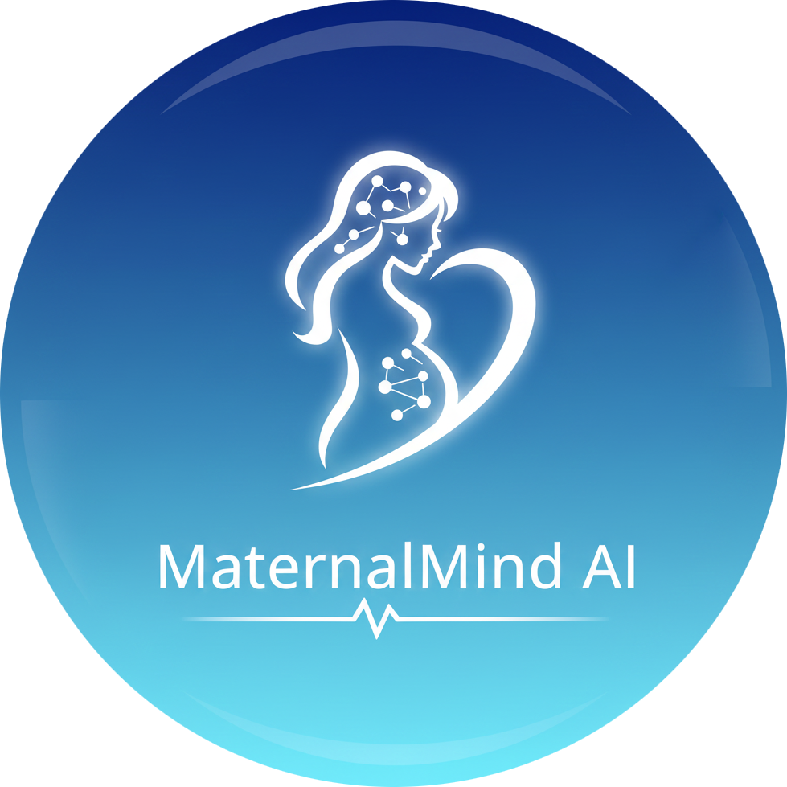
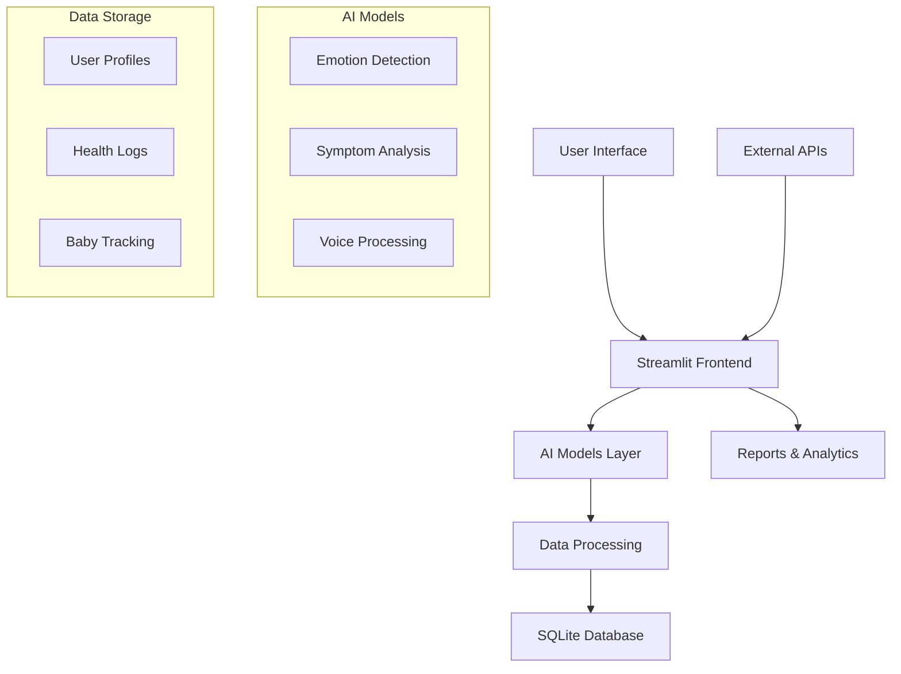

# 🤰 MaternalMind AI - Pregnancy Wellness Platform



<div align="center">

[](https://www.python.org/)
[](https://streamlit.io/)
[](LICENSE)
[](https://www.docker.com/)
[](https://www.tensorflow.org/)
[](https://pytorch.org/)

**AI-Powered Emotional & Physical Wellness Support for Expecting Mothers**


</div>

---

## 🌟 Features

### 🎭 **Emotional Wellness**
- **🤖 AI-Powered Emotion Analysis**: Text and voice-based emotion detection
- **📝 Digital Pregnancy Journal**: Secure journaling with emotional insights
- **📊 Mood Tracking**: Visualize emotional trends throughout pregnancy

### 👶 **Baby Development**
- **🗓️ Week-by-Week Tracking**: Detailed fetal development information
- **👣 Kick Counter**: Track and monitor baby movements
- **📏 Size Comparisons**: Visualize baby growth with fruit comparisons

### 🏥 **Health Monitoring**
- **🤒 Symptom Tracker**: Log and monitor pregnancy symptoms
- **🚨 Emergency Alerts**: Identify and respond to warning signs
- **💊 Medication Log**: Track vitamins and supplements

### 🍎 **Wellness Tools**
- **🥗 Nutrition Tracker**: Meal logging with calorie tracking
- **💪 Exercise Planner**: Pregnancy-safe workout routines
- **📈 Progress Reports**: Generate wellness reports

### 🔒 **Security & Privacy**
- **🔐 End-to-End Encryption**: Secure user data storage
- **👤 Personal Profiles**: Customizable user settings
- **📱 Multi-Device Sync**: Access from any device

---


### Quick Demo Access:
```bash
# Clone and run locally
git clone https://github.com/hamzaajmal8484/MaternalMind-AI.git
cd maternalmind-ai
docker-compose up
# Visit: http://localhost:8501


## 🚀 Quick Start

### Prerequisites
- Python 3.10.9+
- pip 21.0+
- SQLite3

### Installation

#### Method 1: Using pip
```bash
# Clone repository
git clone https://github.com/hamzaajmal8484/MaternalMind-AI.git
cd maternalmind-ai

# Install dependencies
pip install -r requirements.txt

# Run the application
streamlit run app.py
```

#### Method 2: Using Conda
```bash
# Create conda environment
conda create -n maternalmind python=3.10.9
conda activate maternalmind

# Install dependencies
pip install -r requirements.txt

# Launch app
streamlit run app.py
```

---

## 🐳 Docker Deployment

### Single Container Deployment
```bash
# Build and run with Docker Compose
docker-compose up -d

# Access at: http://localhost:8501
```

### Production Deployment
```bash
# Build production image
docker build -t maternalmind-ai:latest .

# Run with volume persistence
docker run -d \
  -p 8501:8501 \
  -v ./data:/app/data \
  -v ./models:/app/models \
  -v ./logs:/app/logs \
  --name maternalmind-ai \
  maternalmind-ai:latest
```

### Docker Commands Cheatsheet
```bash
# Quick commands using Makefile
make build      # Build Docker image
make up         # Start services
make down       # Stop services
make logs       # View logs
make shell      # Access container shell
make backup     # Backup database
```

---

## 🏗️ Architecture



### Tech Stack
| Layer | Technology | Purpose |
|-------|------------|---------|
| **Frontend** | Streamlit | Interactive UI |
| **Backend** | Python 3.10 | Application logic |
| **AI/ML** | TensorFlow, PyTorch | Emotion & symptom analysis |
| **Database** | SQLite | Data persistence |
| **Container** | Docker | Deployment |
| **Monitoring** | Custom logging | Health checks |

---

## 🔧 Development Setup

### Environment Setup
```bash
# 1. Clone repository
git clone https://github.com/hamzaajmal8484/MaternalMind-AI.git
cd maternalmind-ai

# 2. Create virtual environment
python -m venv venv
source venv/bin/activate  # On Windows: venv\Scripts\activate

# 3. Install development dependencies
pip install -r requirements-dev.txt

# 4. Set up environment variables
cp .env.example .env
# Edit .env with your configuration

# 5. Initialize database
python -c "from app import init_database; init_database()"

# 6. Run development server
streamlit run app.py --server.runOnSave=true
```

### Testing
```bash
# Run tests
pytest tests/

# Run with coverage
pytest --cov=app tests/

# Lint code
flake8 app.py

# Format code
black app.py
```

---

## 📊 Project Structure

```
maternalmind-ai/
├── 📁 app/
│   ├── __init__.py
│   ├── app.py              # Main application
│   ├── models/             # AI models
│   │   ├── emotion_detector.py
│   │   └── symptom_analyzer.py
│   ├── utils/              # Utility functions
│   │   ├── database.py
│   │   ├── security.py
│   │   └── visualization.py
│   └── components/         # UI components
│       ├── dashboard.py
│       ├── symptoms.py
│       └── baby_tracker.py
├── 📁 tests/               # Test files
├── 📁 data/                # Data storage
├── 📁 models/              # Trained models
├── 📁 logs/                # Application logs
├── 📁 backups/             # Database backups
├── 📄 requirements.txt     # Dependencies
├── 📄 Dockerfile           # Docker configuration
├── 📄 docker-compose.yml   # Docker Compose
├── 📄 .env.example         # Environment template
├── 📄 .gitignore           # Git ignore rules
├── 📄 LICENSE              # MIT License
└── 📄 README.md            # This file
```

---

## ✨ Future Enhancements

### 🚀 **Phase 1: Enhanced AI Features** (Q2 2026)
- [ ] **🎤 Advanced Voice Analysis**: Real-time emotion detection from voice patterns
- [ ] **🤖 Predictive Analytics**: AI-based symptom prediction and prevention
- [ ] **👩‍⚕️ Virtual Doula Assistant**: 24/7 AI-powered pregnancy support
- [ ] **📱 Mobile App**: iOS and Android native applications
- [ ] **🌐 Multi-language Support**: Internationalization for global users

### 🏥 **Phase 2: Medical Integration** (Q3 2026)
- [ ] **⚕️ EHR Integration**: Connect with electronic health records
- [ ] **📊 Doctor Dashboard**: Healthcare provider portal
- [ ] **📈 Advanced Analytics**: Predictive health insights
- [ ] **🔬 Lab Result Integration**: Sync with medical test results
- [ ] **💊 Medication Management**: Smart medication reminders

### 🤝 **Phase 3: Community & Support** (Q4 2026)
- [ ] **👥 Community Forum**: Peer support and discussions
- [ ] **📅 Appointment Scheduler**: Integrated appointment booking
- [ ] **🎓 Educational Content**: Pregnancy courses and workshops
- [ ] **👶 Postpartum Support**: Extend to postpartum care
- [ ] **🤰 Partner Portal**: Support for partners and family

### 🔧 **Phase 4: Technical Enhancements** (Q1 2027)
- [ ] **☁️ Cloud Deployment**: AWS/Azure cloud infrastructure
- [ ] **📊 Real-time Analytics**: Live data processing
- [ ] **🔗 API Services**: Public API for developers
- [ ] **🔐 Advanced Security**: HIPAA compliance features
- [ ] **📱 Offline Mode**: Functionality without internet

### 🌟 **Phase 5: Advanced Features** (Q2 2027)
- [ ] **🎮 VR/AR Experiences**: Virtual reality baby visualization
- [ ] **📊 Genetic Insights**: Basic genetic trait predictions
- [ ] **🤝 Telemedicine**: Integrated video consultations
- [ ] **🌡️ IoT Integration**: Connect with wearable devices
- [ ] **🎯 Personalized AI Coach**: Custom wellness plans

---

## 🤝 Contributing

We welcome contributions! Here's how you can help:

### 🐛 Reporting Bugs
1. Check existing issues
2. Create new issue with bug template
3. Include steps to reproduce

### 💡 Suggesting Features
1. Check feature roadmap
2. Submit feature request
3. Discuss implementation

### 🔧 Code Contributions
```bash
# 1. Fork repository
# 2. Create feature branch
git checkout -b feature/amazing-feature

# 3. Commit changes
git commit -m 'Add amazing feature'

# 4. Push to branch
git push origin feature/amazing-feature

# 5. Open Pull Request
```

### 📋 Contribution Guidelines
1. Follow PEP 8 style guide
2. Write comprehensive tests
3. Update documentation
4. Ensure backward compatibility
5. Get code review approval

---

## 📄 License

This project is licensed under the MIT License - see the [LICENSE](LICENSE) file for details.

```
MIT License

Copyright (c) 2026 MaternalMind AI

Permission is hereby granted, free of charge, to any person obtaining a copy
of this software and associated documentation files (the "Software"), to deal
in the Software without restriction, including without limitation the rights
to use, copy, modify, merge, publish, distribute, sublicense, and/or sell
copies of the Software, and to permit persons to whom the Software is
furnished to do so, subject to the following conditions:

The above copyright notice and this permission notice shall be included in all
copies or substantial portions of the Software.
```

---

## 📞 Contact

### 👤 Developer
- **Developer**: Hamza Ajmal
- **Email**: [hamzaajmal8484@gmail.com](mailto:hamzaajmal8484@gmail.com)
- **GitHub**: [@hamzaajmal8484](https://github.com/hamzaajmal8484)

### 📝 Project Status
🚧 **Current Status**: Development Phase  
📅 **Target Launch**: Coming Soon  
💻 **Type**: FYP Project / Portfolio  
🎯 **Goal**: Create comprehensive pregnancy wellness platform

### 💬 Connect
- **Issues & Bugs**: [GitHub Issues](https://github.com/yourusername/maternalmind-ai/issues)
- **Feature Requests**: [GitHub Discussions](https://github.com/yourusername/maternalmind-ai/discussions)
- **Code Contributions**: Fork & Submit PRs

### 📧 Email Categories
- **Technical Issues**: hamzaajmal8484@gmail.com
- **Feature Suggestions**: hamzaajmal8484@gmail.com
- **Collaboration Inquiries**: hamzaajmal8484@gmail.com

---

**Note**: This is currently a personal project by Hamza Ajmal. The platform is in development and not yet publicly deployed. For demonstration purposes only.

### 📊 Project Status


---

<div align="center">

### ⭐️ Support the Project

If you find this project helpful, please give it a star on GitHub!

[](https://star-history.com/#hamzaajmal8484/MaternalMind-AI&Date)

**Made with ❤️ for expecting mothers everywhere**

</div>

---

## 🔗 Useful Links


- [🐛 Issue Tracker](https://github.com/hamzaajmal8484/MaternalMind-AI/issues)
- [💬 Discussions](https://github.com/hamzaajmal8484/MaternalMind-AI/discussions)
- [📦 Releases](https://github.com/hamzaajmal8484/MaternalMind-AI/releases)

---

## 🙏 Acknowledgments

- Medical advisors and healthcare professionals
- Open-source community for amazing tools
- All the expecting mothers who provided feedback
- Developers and contributors who made this possible

---

<div align="center">

### 🚨 Important Notice

**Disclaimer**: This platform provides wellness support and tracking only, not medical advice. Always consult healthcare providers for medical concerns.

**For Medical Emergencies**: Contact your healthcare provider immediately or call emergency services.

</div>

---

**Last Updated**: January 2026  
**Version**: 1.0.0  
**Next Release**: v1.1.0 - Enhanced AI Models
